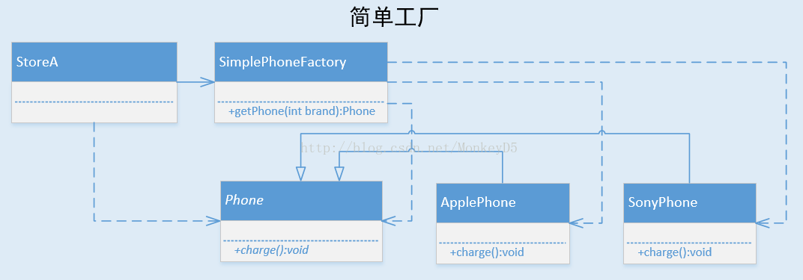

工厂方法模式是为了弥补简单工厂模式的不足并且继承它的优点而延生出的一种设计模式，属于GoF中的一种。它能更好的符合开闭原则的要求。

定义：定义了一个用于创建对象的接口，但是让子类决定将哪一个类实例化。即让类的实例化延迟到子类
### 1.1 定义
工厂方法模式，又称工厂模式、多态工厂模式和虚拟构造器模式，通过定义工厂父类负责定义创建对象的公共接口，而子类则负责生成具体的对象。

### 1.2 主要作用
将类的实例化（具体产品的创建）延迟到工厂类的子类（具体工厂）中完成，即由子类来决定应该实例化（创建）哪一个类。

### 1.3 解决的问题
发现简单工厂模式存在一系列问题：
工厂类集中了所有实例（产品）的创建逻辑，一旦这个工厂不能正常工作，整个系统都会受到影响；
违背“开放 - 关闭原则”，一旦添加新产品就不得不修改工厂类的逻辑，这样就会造成工厂逻辑过于复杂。

### 举个例子：
大众汽车公司想必大家都不陌生，它旗下也有不少汽车品牌。大众汽车公司就好比一个汽车工厂，负责生产和销售汽车。它可以为客户提供一个客户需要的汽车。但是，如果客户需要的汽车大众公司目前还没有，但是公司想要盈利，就必须为此而设计汽车，在这种情况下，大众公司就要新添加一种汽车，同时要修改公司内部的生产环境（也就是工厂类的代码）。这就是简单工厂模式的运行情况。简单而言，就是工厂类（汽车公司）什么都要干，要修改必须大动干戈。因而一定程度上违背了开闭原则。而工厂方法模式则不一样，大众汽车公司不在总公司生产汽车，而是成立分公司，收购别的公司，成立具有针对性的汽车工厂专门生产对应的汽车。若客户的大量需求得不到满足，则总公司就另外成立新的二级公司(新品牌汽车的工厂)生产汽车，从而在不修改具体工厂的情况下引进新的产品。正如大众集团的收购一样。以下为简单工厂模式和工厂方法模式的区别：

如果使用`简单工厂`是这样的模式

如果使用`工厂方法`是这样的模式


### 1.4 模式组成
| 组成（角色） | 关系 | 作用 |
| --- | --- | --- |
| 抽象产品（Product） | 具体产品的父类 | 描述具体产品的公共接口 |
| 具体产品（Concrete Product） | 抽象产品的子类；工厂类创建的目标类 | 描述生产的具体产品 |
| 抽象工厂（Creator） | 具体工厂的父类 | 描述具体工厂的公共接口 |
| 具体工厂（Concrete Creator） | 抽象工厂的子类；被外界调用 | 描述具体工厂；实现FactoryMethod工厂方法创建产品的实例 |

### 2 实例讲解：
手机专卖店`Store`卖手机，目前`Store`卖有两种手机，一个苹果手机，一个索尼手机，此时如果想从手机工厂进货“小米”手机，那么手机总工厂就必须修改内部实现

简单工厂模式由SimplePhoneFactory，集中获取不同的手机实例对象。

工厂方法模式由PhoneFactory的两个实现，分别获取不同的手机实例对象。


####2.1 使用步骤

步骤1： 创建抽象工厂类，定义具体工厂的公共接口
```java
public interface PhoneFactory {
    Phone getPhone();
}
```

步骤2： 创建抽象产品类 ，定义具体产品的公共接口；
```java
public abstract class Phone {
    /**
     * 品牌
     */
    protected String brand;
 
    /**
     * 操作系统
     */
    protected String os;
 
    /**
     * 充电
     */
    public abstract void charge();
 
    public String getBrand() {
        return brand;
    }
 
    public void setBrand(String brand) {
        this.brand = brand;
    }
 
    public String getOs() {
        return os;
    }
 
    public void setOs(String os) {
        this.os = os;
    }
}
```

步骤3：创建具体工厂类（继承抽象工厂类），定义创建对应具体产品实例的方法；
```java
public class ApplePhoneFactory implements PhoneFactory {
    @Override
    public ApplePhone getPhone() {
        ApplePhone applePhone = new ApplePhone();
        applePhone.setBrand("Apple");
        return applePhone;
    }
}
 
public class SonyPhoneFactory implements PhoneFactory {
    @Override
    public SonyPhone getPhone() {
        SonyPhone sonyPhone = new SonyPhone();
        sonyPhone.setBrand("Sony");
        return sonyPhone;
    }
}
```

步骤4： 创建具体产品类（继承抽象产品类）， 定义生产的具体产品；
```java
public class ApplePhone extends Phone {
    @Override
    public void charge() {
        System.out.println("普通充电");
    }
}
 
public class SonyPhone extends Phone {
    @Override
    public void charge() {
        System.out.println("快充");
    }
}
```

步骤5：外界通过调用具体工厂类的方法，从而创建不同具体产品类的实例
```java
public class StoreB {
    private PhoneFactory phoneFactory;
 
    public StoreB(PhoneFactory phoneFactory) {
        super();
        this.phoneFactory = phoneFactory;
    }
 
    /**
     * 补充手机
     */
    public void supplyPhone() {
        Phone phone = phoneFactory.getPhone();
        // 补充手机逻辑...
        System.out.println("补充" + phone.getBrand() + "手机完成");
    }
 
    public static void main(String[] args) {
        StoreB storeB = new StoreB(new SonyPhoneFactory());
        storeB.supplyPhone();
    }
 
}
```

结果：
```
补充Sony手机完成
```

* * *

总结：

* 工厂模式可以说是简单工厂模式的进一步抽象和拓展，在保留了简单工厂的封装优点的同时，让扩展变得简单，让继承变得可行，增加了多态性的体现。

优点：

* 用户只需要知道具体工厂的名称就可得到所要的产品，无须知道产品的具体创建过程；
* 在系统增加新的产品时只需要添加具体产品类和对应的具体工厂类，无须对原工厂进行任何修改，满足开闭原则；

缺点：
* 每增加一个产品就要增加一个具体产品类和一个对应的具体工厂类，这增加了系统的复杂度


### 3 对比：
当要新增其它品牌的手机时，简单工厂模式的SimplePhoneFactory类需要修改getPhone方法代码
工厂方法模式只需增加PhoneFactory的实现即可

### 抽象工厂:
从代码看，如果要从StoreC，StoreD中，选一个来实例化不同的专卖店，
抽象工厂中的StoreD更适合，只要在构造方法那传入不同的单个Factory，即可获得不同的专卖店。
而工厂方法中的StoreC，如果现在有耳机、手机、电脑、电视等等，那用StoreC实例化每个店，都得传入很多Factory，且得注意这些Factory都是同一品牌的。

小结：
* 一类产品有多种不同实例对象（本例的手机，有不同品牌），当新增一种实例对象时（新增一个品牌的手机），工厂方法模式符合 对扩展开放，对修改封闭原则。
* 多类产品分别有多种不同实例对象（本例的手机，耳机都分别有不同品牌），而跨类别的实例对象有联系（本例的联系是同一品牌），暂且称有联系的那些实例对象为同一族。那抽象工厂模式可以让产品用户更方便获取同一族的产品。